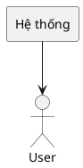
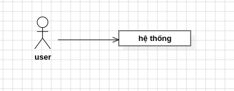

### Dự án Website Quản Lý Chi tiêu
## I. Tổng quan dự án
### Mục tiêu
Mục tiêu của dự án này là xây dựng một website nhỏ hỗ trợ người dùng quản lý và theo dõi chi tiêu cá nhân, giúp việc ghi nhận các khoản chi tiêu hằng ngày trở nên đơn giản và dễ dàng hơn.
### Phạm vi
Phạm vi dự án bao gồm các chức năng như: quản lý thông tin người cá nhân, quản lý ngân sách, quản lý chi tiêu. Việc quản lý chi tiêu sẽ được thực hiện thông qua website.
### Giả định và ràng buộc
- Website chỉ phục vụ nhu cầu quản lý chi tiêu cá nhân, không phải hệ thống quản lý tài chính chuyên nghiệp.
- Website chỉ phục vụ cho một người dùng cá nhân, không hỗ trợ quản lý nhiều người dùng.
- Website chỉ tập trung vào quản lý ngân sách và các khoản chi tiêu, không cung cấp các chức năng tài chính nâng cao.
- Website không cung cấp chức năng thanh toán trực tuyến hoặc kết nối trực tiếp với ngân hàng.
## II. Yêu cầu chức năng
### Các tác nhân

- Hệ thống có 1 tác nhân chính: User.

Code PlantUML

### Các chức năng chính

**User:**

* **Quản lý thông tin cá nhân:** Nhập và lưu tên người dùng khi sử dụng website lần đầu.
* **Quản lý ngân sách:** Nhập ngân sách cho tháng hiện tại và xem thông tin ngân sách.
* **Quản lý chi tiêu:**
    * **Thêm khoản chi:** Nhập tiêu đề và số tiền của khoản chi tiêu.
    * **Xem khoản chi:** Xem các khoản chi tiêu được ghi nhận theo từng ngày.
* **Theo dõi tình hình chi tiêu:**
    * **Xem tổng chi tiêu:** Theo dõi tổng số tiền đã chi trong tháng và trong ngày.
    * **Xem số tiền còn lại:** Theo dõi số tiền còn lại dựa trên ngân sách và khoản chi tiêu.
    
## III. Yêu cầu phi chức năng
### 1. Hiệu suất
* Thời gian tải trang nhanh và phù hợp với nhu cầu sử dụng cá nhân.
* Thời gian phản hồi API nhanh khi thêm hoặc xem dữ liệu chi tiêu.
* Tối ưu hóa mã nguồn và tài nguyên của website.
### 2. Bảo mật
* Bảo vệ dữ liệu được gửi giữa Frontend và Backend.
* Sử dụng các phương pháp phù hợp để hạn chế các lỗi bảo mật phổ biến.
* Không lưu trữ các thông tin nhạy cảm không cần thiết.
### 3. Khả năng mở rộng
* Cấu trúc dự án được tổ chức rõ ràng, dễ dàng bổ sung chức năng mới.
* Có thể mở rộng thêm các chức năng quản lý và thống kê chi tiêu trong tương lai.
* Backend được xây dựng thông qua REST API để thuận tiện cho việc mở rộng.
### 4. Giao diện người dùng
* Giao diện đơn giản, dễ sử dụng.
* Thiết kế responsive, phù hợp với máy tính và thiết bị di động.
* Các thành phần giao diện được thiết kế thống nhất.
* Các thao tác thêm và xem chi tiêu cần đơn giản và nhanh chóng.
### 5. Tương thích
* Website hoạt động trên các trình duyệt phổ biến như Chrome, Firefox, Edge.
* Giao diện có khả năng hiển thị trên nhiều kích thước màn hình.
* Website có thể sử dụng trên máy tính và điện thoại.
### 6. Độ tin cậy
* Dữ liệu chi tiêu được lưu trữ trong cơ sở dữ liệu SQLite.
* Hệ thống đảm bảo dữ liệu được cập nhật sau khi người dùng thêm khoản chi tiêu.
* Hạn chế mất dữ liệu trong quá trình sử dụng.
### 7. Khả năng bảo trì
* Code được tổ chức rõ ràng, dễ đọc và dễ chỉnh sửa.
* Frontend và Backend được phân tách rõ ràng.
* Các chức năng được xây dựng theo từng module để thuận tiện cho việc phát triển.
## IV. Công nghệ
- **Frontend:** Sử dụng HTML, CSS và JavaScript để xây dựng giao diện người dùng.
- **Backend:** Sử dụng Node.js và Express.js để phát triển các chức năng backend.
- **API:** Sử dụng REST API để giao tiếp giữa Frontend và Backend.
- **Cơ sở dữ liệu:** Sử dụng My SQL để lưu trữ thông tin người dùng, ngân sách và chi tiêu.
- **Quản lý mã nguồn:** Sử dụng Git để quản lý mã nguồn và GitHub để lưu trữ repository.
## V. Yêu cầu thiết kế
### Mô hình kiến trúc
Hệ thống được xây dựng theo mô hình Client - Server, bao gồm các thành phần:
- **Client:** Giao diện người dùng được xây dựng bằng HTML, CSS và JavaScript.
  Client chịu trách nhiệm hiển thị giao diện, nhận thao tác từ người dùng và
  gửi yêu cầu đến Backend thông qua REST API.
- **Server:** Backend được xây dựng bằng Node.js và Express.js.
  Server tiếp nhận các yêu cầu từ Client, xử lý logic của ứng dụng và thực hiện
  các thao tác với cơ sở dữ liệu.
- **Database:** Sử dụng My SQL để lưu trữ thông tin người dùng, ngân sách
  tháng và các khoản chi tiêu.
### Mô hình cơ sở dữ liệu
Cơ sở dữ liệu sẽ bao gồm các bảng chính sau:
- **Users:** Lưu thông tin người dùng, bao gồm tên người dùng.
- **Months:** Lưu thông tin ngân sách của từng tháng, bao gồm tháng, năm và số tiền ngân sách.
- **Expenses:** Lưu thông tin các khoản chi tiêu, bao gồm tiêu đề, số tiền, ngày chi tiêu và tháng tương ứng.
###Giao diện người dùng
Giao diện người dùng gồm hai trang chính:
- **Trang chủ:** Hiển thị ngân sách tháng, tổng số tiền đã chi và số tiền còn lại.
- **Trang chi tiêu:** Cho phép thêm và xem các khoản chi tiêu theo từng ngày, đồng thời hiển thị tổng chi tiêu trong ngày.
